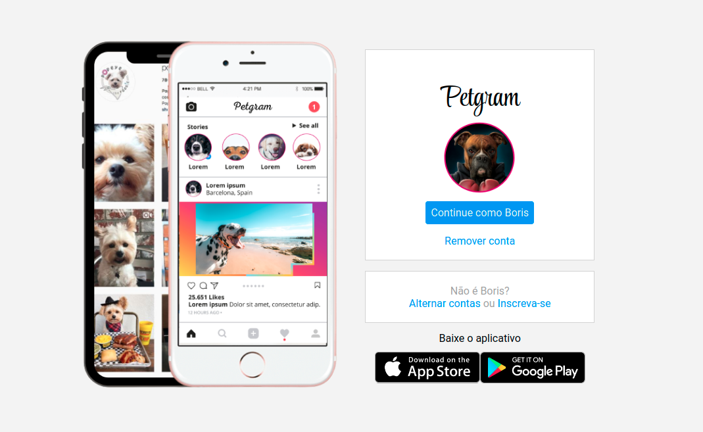

<h1 align="center"> 
    Petgram - projeto recriando a página pnicial do Instagram - DIO 
</h1>

  <a href="#-sobre">Sobre</a>&nbsp;&nbsp;&nbsp;|&nbsp;&nbsp;&nbsp;
  <a href="#-tecnologias">Tecnologias</a>&nbsp;&nbsp;&nbsp;|&nbsp;&nbsp;&nbsp;
  <a href="#-metodologias">Tecnologias</a>&nbsp;&nbsp;&nbsp;|&nbsp;&nbsp;&nbsp;
  <a href="#-deploy">Tecnologias</a>&nbsp;&nbsp;&nbsp;|&nbsp;&nbsp;&nbsp;
  <a href="#-autor">Tecnologias</a>&nbsp;&nbsp;&nbsp;|&nbsp;&nbsp;&nbsp;

## Sobre

Repositório dedicado a resolução do desafio proposto para execução do Projeto: Recriando a página inicial do Instagram contido no Santander BootCamp FullStack Developer da Digital Innovation One. O projeto aborda conceitos de CSS, flexbox e responsividade.

## Tecnologias

O projeto foi desenvolvido a partir das tecnologias:

- `HTML5`
- `CSS3`
- `SASS`

## Metodologia

O projeto foi desenvolvido a partir das metodologias:

- `HTML Semântico`
- `CSS BEM`

## Deploy

[Petgram](https://petgram-omega-bay.vercel.app)

## Autor

[ Jonatas Souza](https://github.com/jotasouza)
